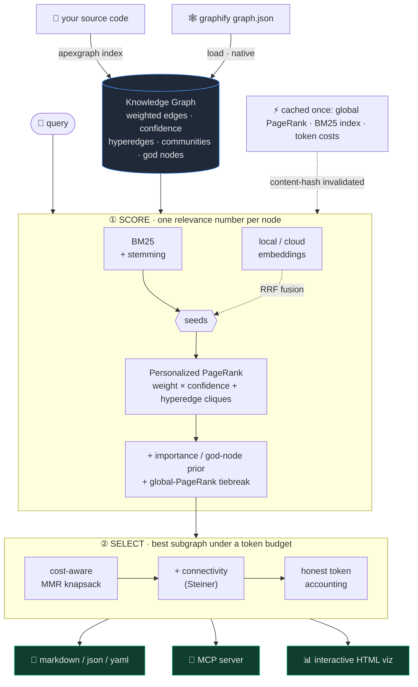

<div align="center">

# ◢◤ Apexgraph

### Apex-relevance subgraph retrieval for AI agents


**Stop dumping your whole knowledge graph into the prompt.**
Apexgraph hands your LLM the *peak* of the graph — the smallest, most relevant
subgraph that answers the query — sized to an exact token budget.

[](https://pypi.org/project/apexgraph/)
[](https://pypi.org/project/apexgraph/)
[](LICENSE)

[](https://github.com/alfonsomayoral/apexgraph/actions/workflows/ci.yml)

[](https://github.com/astral-sh/ruff)
[](https://github.com/psf/black)


**[Quickstart](#-quickstart) · [How it works](#-how-it-works) · [Results](#-results) · [Usage](#-usage-guide) · [MCP](#serve-it-to-an-agent-mcp)**

</div>

---

## ⚡ Quickstart

```bash
uv tool install "apexgraph[local]"        # install (or: pipx install apexgraph)
apexgraph index .                         # build a code graph from source — no LLM
apexgraph "how does auth work" -b 4000    # retrieve the apex subgraph, ≤ 4000 tokens
```

That's it — no API key, no server, no model download for the lexical default.
The command, import and PyPI package are all `apexgraph`.

## 🎯 The problem

Knowledge graphs — the kind `graphify` builds from a codebase — get **big**. A
real app indexes to thousands of nodes. When an agent needs context about *one*
corner of it, the usual options are both bad:

- **Dump the whole graph** → tens of thousands of tokens, most of them irrelevant,
  and the few nodes that matter are buried in noise.
- **Naive keyword match + BFS** → walks into the wrong neighbourhood and returns a
  pile of off-topic nodes (translation strings, unrelated helpers).

You want the *opposite*: a tight, on-topic, **connected** slice of the graph that
fits the budget you have — and you want it in milliseconds, offline, every query.

## ✨ What Apexgraph does

Apexgraph scores every node against your query, then selects the highest-value
subgraph that fits a token ceiling. One command, one principled relevance number
per node, a budget that's never exceeded.



It reads graphify's graphs **natively** and uses the rich signals graphify emits
— edge weights, confidence, hyperedges, communities, god nodes — that simpler
tools throw away. Or skip graphify entirely: `apexgraph index` builds a clean,
code-only graph from your source in ~1.5 s.

## 🧩 Capabilities

| | |
|---|---|
| 🎯 **Principled relevance** | BM25 (with stemming) seeds a Personalized PageRank walk over the weighted graph. One unified score — not a hand-tuned mix of independent axes. |
| 🧠 **Semantic recall, offline** | `--backend local` (model2vec) finds what the query is *about* even with **zero shared tokens** — "authorization gate" surfaces the auth code. No API key, no network. Cloud `openai` / `voyage` also available. |
| 📐 **Budget solved as a knapsack** | Selection maximises value *per token* with an MMR diversity penalty and a connectivity bonus — a tight, non-redundant slice, not a bag of islands. Exact DP mode for the value ceiling. |
| 💯 **Honest token accounting** | A node's cost is its *final rendered form*, including injected source code — so `tokens_used` never lies and the output never overflows the budget. |
| ⚡ **Fast & cached** | Query-independent work (global PageRank, the BM25 index, token costs) is precomputed once and cached, invalidated by content hash. A query is a lookup plus one walk — ~0.1 s on a 9k-node graph. |
| 🔌 **MCP server** | Stdlib JSON-RPC over stdio (no SDK). Exposes `apexgraph_query`, `apexgraph_explain`, `apexgraph_path`, `apexgraph_stats` to Claude Code and any MCP agent. |
| 🏗️ **Built-in indexer** | Python (`ast`), TypeScript/JS (tree-sitter → regex), Go (regex). `--strict-ids` for collision-free ids; incremental re-index by file hash. |
| 🧷 **Connected output** | `--connected` stitches the result toward a single connected subgraph (approximate Steiner) within budget. |
| 🔒 **Safe by default** | Code injection is contained to the project root (no path-traversal exfiltration); the HTML viz pins its CDN script with Subresource Integrity. |
| 📤 **Drops in anywhere** | Render to markdown / json / yaml, or `export` a context block ready to paste into a Claude / ChatGPT system prompt or a `CLAUDE.md`. |

## 📊 Results

**Two real codebases, two very different graph shapes, the same outcome: Apexgraph
returns ~2× more on-topic code, in a third of the nodes, an order of magnitude
faster.** Head-to-head against `graphify`, averaged over 10 feature queries at a
2,000-token budget — graphify answers with its native graph + BFS query; Apexgraph
builds its own code-only index and retrieves.

<div align="center">

| metric | codebase | graphify | **apexgraph** |
|---|---|:---:|:---:|
| 🎯 **on-topic precision** | clean backend | 31% | **59%** `bm25` |
| 🎯 **on-topic precision** | localized app | 3% | **47%** `local` |
| 🧹 **localization-string noise** | localized app | 80% | **0%** |
| 🎈 **nodes returned** (avg) | both | ~39 | **~24** |
| ⚡ **latency / query** | both | 0.5–0.8 s | **<0.2 s** |

</div>

Apexgraph is **~2× more precise on the clean backend** (pure retrieval quality, no
noise to hide behind) and **~16× more precise on the localization-heavy app** — its
own indexer keeps only code, and its scoring ranks the *actual* feature code to the
top instead of walking into translation strings.

> **Which backend?** `bm25` (default) wins on well-named code where symbols already
> describe themselves; the offline `local` backend wins when the query vocabulary
> differs from the symbol names (natural-language questions, or UI code).
>
> *Precision = returned nodes that are on-topic feature code. Recall isn't compared
> (the two tools index different node universes). Full methodology and a separate
> slurp head-to-head live in [`bench/`](bench/).*

## ⚙️ How it works

**Relevance is one number, computed properly.** BM25 finds the nodes the query is
literally about; those seed a **Personalized PageRank** random walk that spreads
relevance across the weighted graph — edge `weight × confidence`, plus hyperedges
exploded into weighted cliques. A light importance / god-node prior and a global
PageRank tiebreak refine the ranking *only among nodes the walk reached*, so a node
unrelated to the query stays at exactly zero (an honest "nothing matched").

**Semantic recall, when you want it.** Add `--backend local` and BM25's ranking is
fused with offline embedding similarity via Reciprocal Rank Fusion (rank-based, so
the two scales need no calibration). A query like *"sign in flow"* then seeds the
walk from the login code even though they share no tokens.

**Selection is a budgeted 0/1 knapsack, solved as one.** Picking the best set of
nodes under a token ceiling is exactly the knapsack problem. Apexgraph selects by
*marginal value per token* and shapes the result with two terms — an MMR penalty so
it doesn't say the same thing twice, and a connectivity bonus so the subgraph holds
together. The single most relevant node is guaranteed to survive.

## 🚀 Usage guide

### Install

```bash
uv tool install apexgraph              # core (fully local, lexical)
uv tool install "apexgraph[local]"     # + offline semantic recall (model2vec)
uv tool install "apexgraph[ts]"        # + precise TypeScript indexing (tree-sitter)
uv tool install "apexgraph[dense]"     # + cloud embeddings (OpenAI / Voyage AI)
# or: pipx install apexgraph
```

Requires Python 3.12+. The command is `apexgraph`.

### 1 · Get a graph

Either point Apexgraph at a graph `graphify` already built, **or** build one from
source with no LLM:

```bash
apexgraph index ./src                    # → ./src/graphify-out/graph.json
apexgraph index ./src --strict-ids       # collision-free node ids
apexgraph index ./src --incremental      # re-index only changed files
apexgraph stats                          # nodes / edges / communities / god nodes
```

### 2 · Query it

`apexgraph QUERY` is the default — any unrecognised first argument is treated as a
query. The graph is auto-discovered (or pass `-g PATH`).

```bash
apexgraph "how does session validation work" -b 2000
apexgraph "authorization gate" --backend local      # offline semantic recall
apexgraph "auth flow" --explain                      # per-node score breakdown
apexgraph "auth flow" --inject-code                  # include real function bodies
apexgraph "auth flow" --connected                    # stitch toward a connected slice
apexgraph "auth flow" --viz                          # interactive force-directed HTML
```

A query renders a budgeted subgraph with a header that never lies about its size:

```text
┌──────────────────────────────────────────────────────────────┐
│ Apexgraph subgraph for: how does session validation work       │
│ Selected 8/9314 nodes (0.1%) · 1487/2000 tokens               │
└──────────────────────────────────────────────────────────────┘
## Relevant Nodes
### validate_token (function) · score: 1.00
...
```

<details>
<summary><b>Key flags for <code>apexgraph query</code></b></summary>

| flag | default | meaning |
|------|---------|---------|
| `-b, --budget` | 4000 | token ceiling (never exceeded) |
| `-f, --format` | markdown | `markdown` · `json` · `yaml` |
| `--backend` | bm25 | `bm25` · `local` · `openai` · `voyage` |
| `--explain` | off | per-node BM25 / semantic / PPR / prior table |
| `--inject-code` | off | embed real source bodies (counted in the budget) |
| `--connected` | off | best-effort connected subgraph (Steiner) |
| `--min-score` | 0.05 | drop candidates below this relevance |
| `--strategy` | greedy | `greedy` (MMR) · `exact` (DP knapsack) |
| `--viz` | off | open an interactive HTML visualisation |

</details>

### 3 · Inspect & export

```bash
apexgraph explain <node_id>                  # a node + its neighbourhood
apexgraph path <a> <b>                        # shortest path between two nodes
apexgraph diff old.json new.json -b 2000      # change-impact subgraph
apexgraph export "auth flow" -f claudemd -o CONTEXT.md   # paste-ready context block
apexgraph benchmark -q "auth flow" -b 2000    # recall@budget + token savings
```

### Serve it to an agent (MCP)

Apexgraph speaks the Model Context Protocol over stdio:

```bash
apexgraph serve --graph graph.json
# register with Claude Code:
claude mcp add apexgraph -- apexgraph serve --graph /abs/path/to/graph.json
```

Tools exposed: `apexgraph_query`, `apexgraph_explain`, `apexgraph_path`, `apexgraph_stats`.

## 🛠️ Development

```bash
git clone https://github.com/alfonsomayoral/apexgraph && cd apexgraph
uv sync
uv run pytest          # 229 tests
uv run ruff check .    # lint
uv run black --check . # format
```

See [`CONTRIBUTING.md`](CONTRIBUTING.md) for the architecture map and
[`RELEASING.md`](RELEASING.md) for the trusted-publishing release flow.

## 📄 License

MIT © [Alfonso Mayoral](https://github.com/alfonsomayoral)
